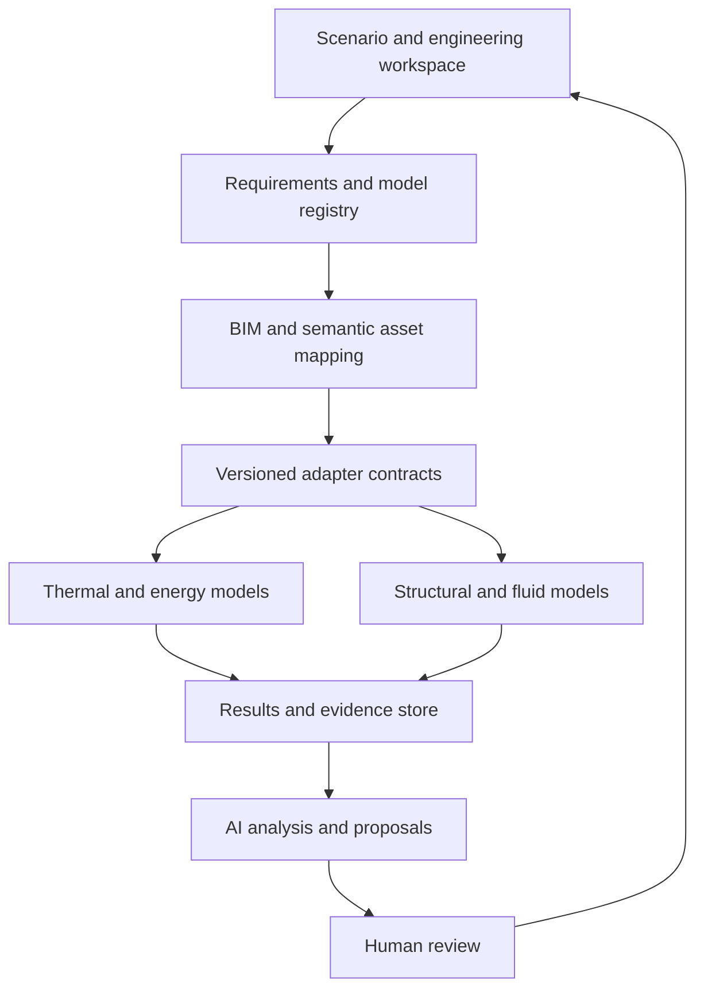
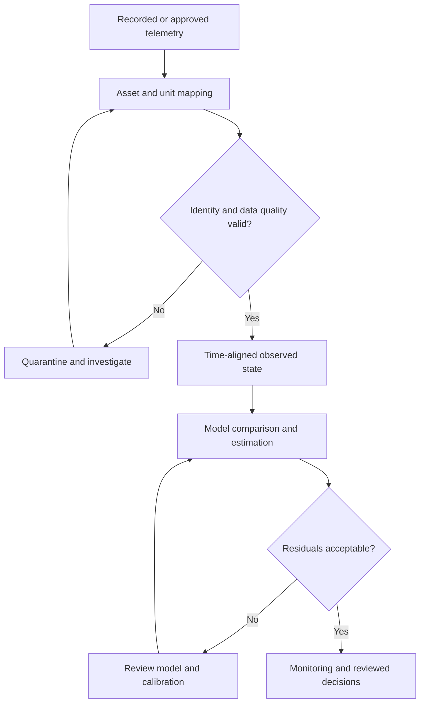
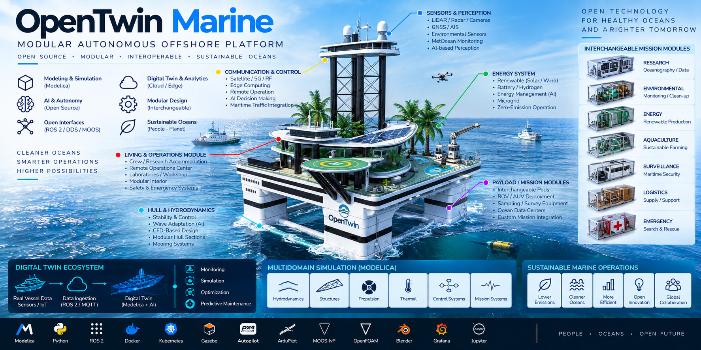
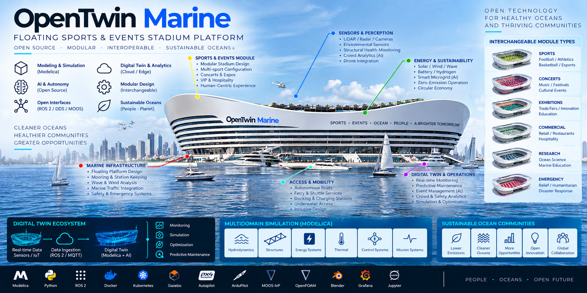
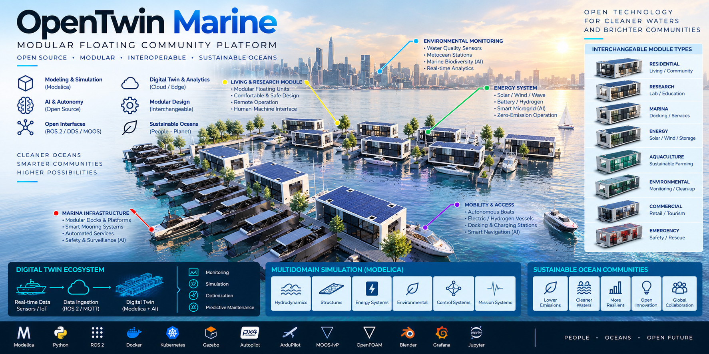
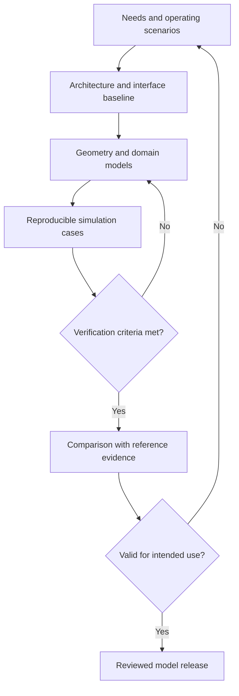
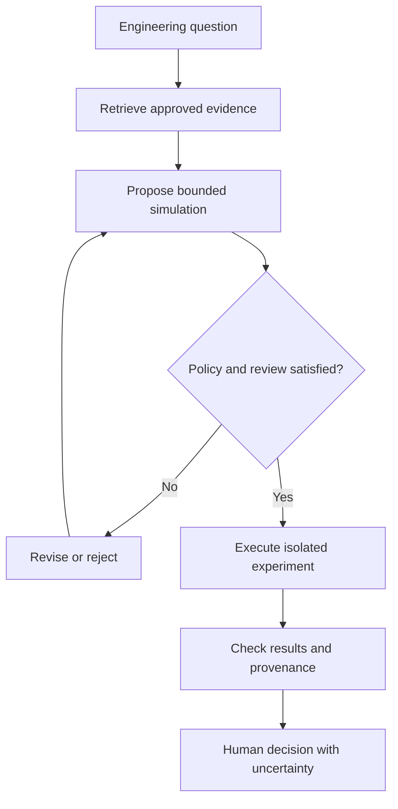

# jfxai4bss

**Open Building, Infrastructure & Smart Community Digital Twin Platform**

> Open-source reference architecture and technology compendium for
> building simulation, sustainable infrastructure, modular architecture,
> floating communities, smart facilities, Modelica-based multidomain
> engineering, AI, and interoperable built-environment digital twins.

**jfxai4bss** is an open engineering and research project focused on
modeling, simulation, optimization, and digital-twin representation of
buildings, infrastructure, modular communities, and experimental
floating or offshore built environments.

The architecture combines **MBSE, BIM/IFC, CAD/CAM/CAS, Modelica,
building-energy simulation, structural analysis, CFD, IoT, AI,
optimization, and modular digital-twin interfaces** while avoiding
dependence on a single proprietary platform.

**Current baseline:** a reference README and three concept illustrations under `MBSE/CAD`. No executable twin, BIM dataset, solver adapter or root licence file is present in this baseline. The architecture and interfaces below are implementation proposals.

## Table of Contents

- [Vision](#vision)
- [Description and Context](#description-and-context)
- [Objectives](#objectives)
- [Reference Architecture](#reference-architecture)
- [OpenTwin Built](#opentwin-built)
- [Modular Digital Twin Interfaces](#modular-digital-twin-interfaces)
- [Interface Profiles](#interface-profiles)
- [Technology Compendium](#technology-compendium)
- [Modular Built Environment](#modular-built-environment)
- [Floating and Offshore Infrastructure](#floating-and-offshore-infrastructure)
- [CAD Concept Catalogue](#cad-concept-catalogue)
- [Model Verification and Validation Workflow](#model-verification-and-validation-workflow)
- [AI Proposal and Review Workflow](#ai-proposal-and-review-workflow)
- [Repository Structure](#repository-structure)
- [User Guide](#user-guide)
- [Installation](#installation)
- [Dependencies](#dependencies)
- [Roadmap](#roadmap)
- [Contributing](#contributing)
- [Code of Conduct](#code-of-conduct)
- [Authors](#authors)
- [Intellectual Property](#intellectual-property)
- [Disclaimer](#disclaimer)
- [License](#license)
- [Open Engineering Principles](#open-engineering-principles)

## Vision

**MBSE + BIM + Modelica + Energy + Structures + CFD + Digital Twins +
AI**

Core principles are open architecture, modular systems, interoperable
twins, replaceable solvers, multi-fidelity simulation, reproducible
research, sustainable design, and technology independence.

## Description and Context

The project organizes architecture, structures, HVAC, energy, water,
electrical systems, controls, environmental simulation, occupancy,
sensing, automation, and lifecycle information into a common engineering
architecture.

Representative applications include conventional and smart buildings,
modular housing, smart communities, sports/event complexes, research
facilities, emergency infrastructure, floating buildings, floating
neighborhoods, offshore habitats, sustainable campuses, and
digital-twin-enabled facilities.

## Objectives

-   Integrate MBSE with BIM and executable engineering models.
-   Support IFC-oriented interoperability.
-   Use Modelica for multidomain physical simulation.
-   Integrate building-energy, structural, and environmental simulation.
-   Connect IoT/BMS telemetry to virtual assets.
-   Provide solver-independent digital-twin interfaces.
-   Enable AI prediction, diagnostics, and optimization.
-   Support modular, community-scale, floating, and offshore concepts.
-   Separate required dependencies, optional integrations, and research
    references.

## Reference Architecture



Simulation outputs remain distinct from observations. The default AI path is advisory; equipment commands require a separate permissioned control interface.

## OpenTwin Built

**OpenTwin Built** is a technology-neutral digital-twin architecture.



A live digital twin requires an identified asset, synchronised measurements and maintained calibration. Without those, the deliverable is a virtual model or replay prototype.

It can represent a virtual building, connected facility, infrastructure
system, modular community, or experimental floating/offshore complex.

## Modular Digital Twin Interfaces

### BIM / IFC Interface

Separates semantic building information from vendor-specific authoring
tools and exposes geometry, spaces, elements, systems, properties, and
relationships.

### Geometry Interface

Supports IFC geometry, meshes, B-Rep, analytical geometry, GIS geometry,
and visualization assets so each simulation discipline can use an
appropriate representation.

### Asset Adapter Interface

Normalizes physical devices, BMS/IoT gateways, meters, sensors,
timestamps, units, quality metadata, and asset identities.

### Telemetry Interface

Example namespace:

```text
zone.temperature
zone.humidity
zone.co2
hvac.air_flow
energy.electric_power
energy.pv_generation
battery.soc
water.flow
structure.acceleration
environment.wind_speed
environment.solar_irradiance
occupancy.count
```

### Model Interface

```text
initialize()
configure(parameters)
set_environment()
set_inputs(values)
step(dt)
get_outputs()
get_state()
set_state()
reset()
shutdown()
```

Adapters can wrap Modelica/FMUs, EnergyPlus, structural solvers, CFD,
Python models, ROMs, and AI surrogates.

### FMI / FMU Interface

Provides a portable boundary for physical models, controls, HVAC,
thermal zones, electrical systems, and co-simulation.

### State Interface

```text
Observed State
Estimated State
Simulated State
Operational State
Health State
Configuration State
```

### Environment Interface

Outdoor temperature, humidity, solar radiation, wind, rain, air quality,
and---where relevant---waves, currents, water level, and salinity.

### Energy Interface

Grid, PV, wind, battery storage, thermal storage, generators, EV
charging, microgrids, and demand response.

### HVAC / Controls Interface

Setpoints, schedules, modes, constraints, actuator commands, equipment
state, and supervisory control.

### Structural Interface

Geometry, materials, loads, boundary conditions, solver execution,
response metrics, and structural-health outputs.

### CFD Interface

Indoor airflow, natural ventilation, urban wind, thermal comfort,
pollutant transport, and offshore wind exposure.

### Water Interface

Potable water, wastewater, rainwater, reuse, storage, pumping, and
monitoring.

### Occupancy Interface

Aggregated occupancy, zone presence, schedules, activities, demand
profiles, and event loads, with privacy-aware data minimization.

### AI / Optimization Interface

Supports energy forecasting, anomaly detection, predictive maintenance,
HVAC optimization, design-space exploration, and community resource
optimization.

### Health Interface

```text
anomaly_score
structural_health
hvac_health
energy_health
water_health
sensor_health
confidence
recommended_action
```

### Visualization Interface

Web dashboards, Grafana, Jupyter, GIS, BIM viewers, 3D engines, and
experimental AR/VR clients consume standardized twin data.

### Model Registry Interface

Tracks model ID, version, fidelity, provenance, compatibility,
validation status, and license.

## Interface Profiles

| Profile | Proposed scope |
| --- | --- |
| Minimal | Geometry, model, state and environment |
| Connected | Minimal profile plus telemetry and asset adapters |
| Intelligent | Connected profile plus reviewed AI and health analytics |
| Infrastructure | Structures, CFD, water and utility interfaces |
| Community | Multiple assets and shared energy, water and services |

Profiles are selectable configurations, not evidence of implemented maturity levels.

**Minimal Building Twin:** BIM/geometry + model + state + environment.

**Connected Building Twin:** minimal profile + telemetry + asset
adapters + HVAC/energy + storage.

**Intelligent Building Twin:** connected profile + AI/optimization +
occupancy + health monitoring.

**Infrastructure Twin:** intelligent profile + structures + CFD +
water + utility interfaces.

**Smart Community Twin:** infrastructure profile + multiple buildings +
microgrid + shared water + mobility + community services + shared model
registry.

## Technology Compendium

Technologies are research references unless an executable module
explicitly declares them as dependencies.

| Layer | Candidate open technologies |
| --- | --- |
| MBSE | Capella / Arcadia |
| BIM / IFC | IFC, IfcOpenShell, FreeCAD |
| Physical modeling | Modelica / OpenModelica |
| Building energy | EnergyPlus, OpenStudio |
| Modelica buildings | IBPSA, Buildings, BuildSysPro, IDEAS |
| Structures | OpenSees, CalculiX, Code_Aster |
| CFD | OpenFOAM, SU2 |
| Co-simulation | FMI/FMU, BCVTB-oriented workflows |
| IoT / integration | MQTT, OPC UA, REST/WebSocket |
| AI / analytics | Python ecosystem |
| Visualization | Blender, Grafana, Jupyter |
| Containers | Docker |
| Orchestration | Kubernetes |

Digital-twin and visualization technologies such as iTwin.js and DTCC
may be evaluated as optional research references rather than mandatory
architectural dependencies.

## Modular Built Environment

| Shared module | Interface responsibility |
| --- | --- |
| Structure and envelope | Geometry, material assumptions, loads and attachments |
| HVAC, electrical and energy | Demand, thermal flows, power and equipment states |
| Water and controls | Flow, quality metadata, schedules and operating constraints |
| Communications and API | Identity, schemas, timestamps and access policy |
| Use-specific modules | Residential, commercial, education, healthcare, research, sports, emergency and community services |

Module replacement requires review of loads, mass distribution, utilities and applicable performance criteria.

This abstraction supports reuse across buildings, modular neighborhoods,
floating structures, and community-scale infrastructure.

## Floating and Offshore Infrastructure

Conceptual floating/offshore designs are treated as research
configurations rather than construction-ready designs.

| Subsystem | Proposed study |
| --- | --- |
| Platform and moorings | Buoyancy, stability, motions, structural and connection loads |
| Buildings and shared utilities | Energy, HVAC, potable water, wastewater and communications |
| Access and operations | Docking, passenger movements, service logistics and emergency scenarios |
| Monitoring | Environmental conditions, structural response and equipment state |

Onshore building models do not establish offshore suitability; marine interfaces and reference load cases need separate definition.

Concept profiles include:

-   **Floating Modular Neighborhood** --- interchangeable residential,
    commercial, research, and utility modules.
-   **Offshore Mixed-Use Complex** --- accommodation, services,
    research, logistics, energy, and public space.
-   **Floating Sports & Event Complex** --- configurable occupancy,
    structural, energy, environmental, and mobility models.
-   **Emergency / Resilience Platform** --- relocatable shelter,
    logistics, energy, water, communications, and emergency-support
    modules.

## CAD Concept Catalogue

The [CAD directory](MBSE/CAD/) contains three OpenTwin Marine concept boards. In this repository, OpenTwin Marine identifies maritime concept illustrations; OpenTwin Built is the proposed building/infrastructure integration architecture. Their connection is a proposed model mapping, not an implemented shared runtime.

### Modular Offshore Platform



The board depicts an elevated multi-column platform with living and operations spaces, research facilities, a crane, a landing area, renewable-energy features and interchangeable mission pods. Candidate uses shown include research, environmental monitoring, energy, aquaculture, logistics and emergency support.

The historical filename refers to a self-propelled twin-hulled semi-submersible. The image does not resolve the submerged hull arrangement, propulsion installation or station-keeping capability. These remain requirements to establish rather than demonstrated features. Autonomy and zero-emission labels likewise represent proposed goals.

**Proposed studies:** platform motions, mass and centre-of-gravity changes with payloads, mooring loads, utility demand, thermal comfort and service logistics. A propulsion study requires a defined configuration first.

### Floating Sports and Events Stadium



This board proposes a large floating venue combining stadium/event spaces, hospitality, docking and shared services. Illustrated configurations include sports, concerts, exhibitions, commercial activities, research and emergency use. Monitoring, microgrid and crowd analytics are proposed capabilities.

**Proposed studies:** event-dependent occupancy and loads, structural response, platform motion, wind exposure, HVAC and electrical demand, ferry access and evacuation scenarios. Passenger capacity, transport throughput and emergency performance must be established from explicit scenarios rather than inferred from the render. Use aggregated occupancy data by default.

### Modular Floating Community



The image shows a marina-like arrangement of modular residences, research spaces, docks, rooftop solar and shared services. Proposed module types include housing, research, marina, energy, aquaculture, environmental monitoring, commercial and emergency facilities.

The historical filename contains “hurricane-proof” and “self-elevating”; neither storm resistance nor an elevating mechanism is demonstrated by this board. The current catalogue therefore describes it as a modular floating community and retains the asset filename for link compatibility.

**Proposed studies:** inter-module connections, mooring and water-level response, household utility demand, microgrid sharing, water systems and accessible circulation. Storm scenarios, safe refuge and evacuation require independent site-specific assessment; the artwork establishes no guaranteed resilience level.

### Common Simulation Work Packages

| Work package | Candidate tools and boundaries | Evidence needed |
| --- | --- | --- |
| Geometry and semantics | FreeCAD, IfcOpenShell and Blender; distinguish visual meshes from analysis geometry | Asset IDs, units, coordinate frames, geometry revisions and interface map |
| Building performance | EnergyPlus/OpenStudio and reviewed Modelica building libraries | Weather, occupancy, envelope and equipment assumptions |
| Structures | OpenSees, CalculiX or Code_Aster after model selection | Loads, materials, supports, sensitivity and reference comparisons |
| Fluid and marine response | OpenFOAM plus a separately selected marine model | Sea-state inputs, buoyancy assumptions, mesh/time-step checks and validation data |
| Utilities and coupling | OpenModelica/FMI with explicit adapters | Energy/water balances, signal definitions and synchronisation checks |
| Inspection and replay | BIM viewers, dashboards and optional Godot with gdext | Provenance-linked results; visualisation does not replace physical validation |

Tool assignments are proposed, not installed dependencies. Software logos in artwork do not establish compatibility or licence coverage. No executable BIM, structural or hydrodynamic model accompanies these boards.

## Model Verification and Validation Workflow



Verification checks implementation, numerical behaviour and interface consistency. Validation compares model results with appropriate evidence for a stated use. Record model revision, solver settings, inputs, uncertainty and reviewer decisions. No building or marine performance is validated by this documentation update.

## AI Proposal and Review Workflow



Use synthetic or de-identified operational data in examples. Keep observed, estimated and simulated states separately labelled. AI outputs do not directly change BMS setpoints, marine station keeping or emergency systems in the default research profile.

## Repository Structure

The tree below is a proposed future layout. The current repository contains `README.md` and three images in `MBSE/CAD`; the listed code and model folders are implementation targets.

```text
jfxai4bss/
├── README.md
├── LICENSE
├── CONTRIBUTING.md
├── CODE_OF_CONDUCT.md
├── MBSE/
├── BIM/
│   ├── ifc/
│   ├── geometry/
│   └── mappings/
├── CAD/
├── CAS/
│   ├── modelica/
│   ├── energy/
│   ├── structures/
│   └── cfd/
├── digital-twin/
│   ├── core/
│   ├── state/
│   ├── synchronization/
│   ├── health/
│   └── registry/
├── interfaces/
│   ├── asset/
│   ├── bim/
│   ├── telemetry/
│   ├── environment/
│   ├── energy/
│   ├── hvac/
│   ├── structural/
│   ├── water/
│   ├── occupancy/
│   ├── fmi/
│   ├── mqtt/
│   ├── opcua/
│   └── rest/
├── ai/
├── simulation/
├── schemas/
└── docs/
```

## User Guide

1.  Define the building, infrastructure, or community use case.
2.  Capture requirements through MBSE.
3.  Define BIM/IFC information boundaries.
4.  Select simulation fidelity for each discipline.
5.  Configure physical systems.
6.  Wrap models with modular interfaces.
7.  Configure environmental conditions.
8.  Execute virtual simulations.
9.  Connect real or synthetic telemetry if required.
10. Synchronize twin state.
11. Apply AI, optimization, or diagnostics.
12. Validate against reference or experimental data.
13. Record model version, provenance, and validation status.

## Installation

jfxai4bss is a compendium and reference architecture rather than a
mandatory monolithic distribution.

```bash
git clone https://github.com/robotics-intelligent-systems/jfxai4bss.git
cd jfxai4bss
```

Conceptual toolchain:

Use the [technology compendium](#technology-compendium) to select the smallest toolset for a reproducible experiment. There is no project-level build or launch command in the current baseline.

Each executable module should document exact tested versions, OS
requirements, compilers/SDKs, package managers, build procedures, and
tests.

## Dependencies

Three categories are maintained:

1.  **Required Dependencies** --- strictly required by an executable
    module.
2.  **Optional Integrations** --- replaceable simulation, messaging,
    storage, visualization, AI, or optimization components.
3.  **Research References** --- technologies evaluated for comparative
    research but not required to execute jfxai4bss.

Each integration should document its version, purpose, license,
interface, required/optional status, and validation status.

## Roadmap

### Phase 1 --- Compendium Refactoring

-   [x] Organize building and infrastructure technologies.
-   [x] Establish MBSE/BIM/CAD/CAS context.
-   [x] Define OpenTwin Built architecture.
-   [x] Define modular digital-twin interfaces.
-   [ ] Normalize technology metadata and licenses.

### Phase 2 --- Canonical Interfaces

-   [ ] BIM/IFC mapping.
-   [ ] Telemetry and environment schemas.
-   [ ] State and parameter schemas.
-   [ ] Model-fidelity metadata.

### Phase 3 --- OpenTwin Built MVP

-   [ ] Twin core.
-   [ ] State and model APIs.
-   [ ] Telemetry adapter.
-   [ ] Synthetic smart-building demonstration.

### Phase 4 --- Modelica / FMI

-   [ ] Simplified thermal-zone model.
-   [ ] HVAC and energy modules.
-   [ ] FMU export/import.
-   [ ] Replaceable-model demonstration.

### Phase 5 --- BIM and Building Energy

-   [ ] IFC ingestion.
-   [ ] BIM-to-twin mapping.
-   [ ] EnergyPlus adapter.
-   [ ] Building-performance dashboard.

### Phase 6 --- Structures and CFD

-   [ ] Structural adapter.
-   [ ] OpenSees experiment.
-   [ ] CFD adapter.
-   [ ] Wind/ventilation benchmark.

### Phase 7 --- Intelligent Infrastructure

-   [ ] Energy forecasting.
-   [ ] Anomaly detection.
-   [ ] Predictive maintenance.
-   [ ] HVAC optimization.
-   [ ] Health-monitoring interface.

### Phase 8 --- Smart Communities / Floating Concepts

-   [ ] Multi-building twin.
-   [ ] Community microgrid.
-   [ ] Shared water model.
-   [ ] Floating-platform interface.
-   [ ] Modular neighborhood scenario.
-   [ ] Sports/event complex scenario.
-   [ ] Emergency/resilience configuration.

## Contributing

Contributions are welcome in BIM/IFC, Modelica, building-energy
simulation, structures, CFD, IoT, digital twins, AI, optimization,
controls, modular architecture, sustainable infrastructure,
floating/offshore research, documentation, and validation.

```bash
git checkout -b feature/my-contribution
git add .
git commit -m "Add: description of contribution"
git push origin feature/my-contribution
```

Pull requests should explain the problem, solution, interface
compatibility, dependencies, licenses, validation method, and
simulation/test results.

## Code of Conduct

Contributors are expected to maintain a professional, inclusive, and
collaborative environment. A dedicated `CODE_OF_CONDUCT.md` should be
maintained in the repository root.

## Authors

Maintained by the **Robotics Intelligent Systems** open-source
initiative.

Project repository: `robotics-intelligent-systems/jfxai4bss`

Third-party projects retain their respective authorship, trademarks, and
licenses.

## Intellectual Property

jfxai4bss is intended to create original, sufficiently abstract,
reusable engineering models.

Concept images, architectural references, and third-party designs used
during research should be treated as inspiration or comparative
references and not as project-owned designs unless explicitly created
and licensed for the project.

The project should avoid reproducing proprietary BIM models, copyrighted
architectural drawings, patented mechanisms, confidential
specifications, restricted datasets, and proprietary construction
details.

## Disclaimer

jfxai4bss is a **research, educational, and experimental project**. It
is not a certified architecture, structural-engineering,
building-control, fire/life-safety, offshore-engineering, or
construction platform.

Simulation, AI, optimization, and digital-twin outputs must not be the
sole basis for designing, constructing, operating, certifying, or
maintaining real buildings or infrastructure.

Floating and offshore concepts additionally require qualified naval
architecture, marine engineering, structural and stability analysis,
mooring analysis, environmental assessment, evacuation planning, and
regulatory review.

The BID repository template is used solely as a documentation-structure
reference. jfxai4bss does not claim BID funding, endorsement, catalog
membership, or institutional affiliation.

## License

No root `LICENSE` file is present in the inspected baseline. Publish an explicit project licence before distributing original implementation code.

Third-party software, datasets, models, standards, and documentation
retain their respective licenses. The BID software license should not be
automatically applied merely because the BID documentation template was
used as a structural reference.

## Open Engineering Principles

**Open Standards · Modular Interfaces · BIM/IFC · Modelica · FMI ·
Digital Twins · Multi-Fidelity Simulation · Sustainable Infrastructure**

> Define interfaces before implementations.\
> Model before manufacturing.\
> Simulate before construction.\
> Validate before deployment.\
> Keep every digital-twin component replaceable.
